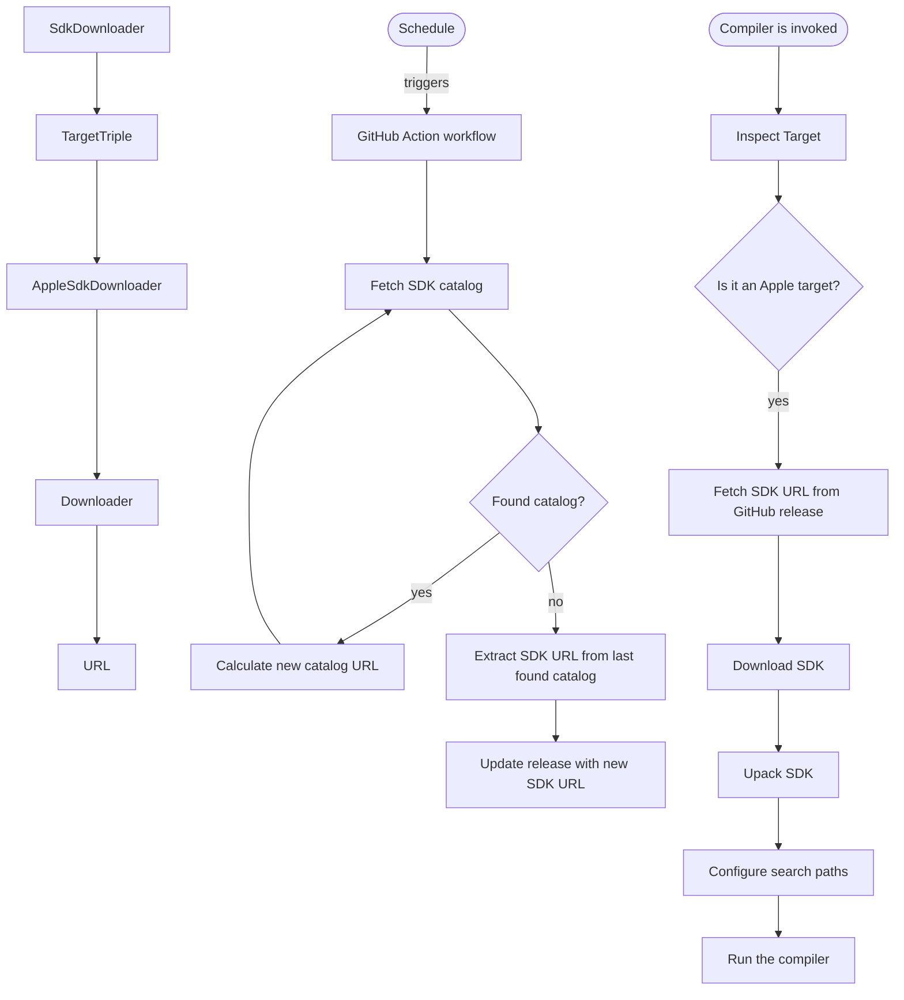

# DXC - D Cross-Compiler

```mermaid
flowchart TD
    SdkDownloader --> TargetTriple --> AppleSdkDownloader --> Downloader --> URL

    schedule([Schedule]) -->
        |triggers| workflow[GitHub Action workflow] -->
        fetch_sdk[Fetch SDK catalog] -->
        sdk_decision{Found catalog?} -->
        |yes| calculate_url[Calculate new catalog URL] -->
        fetch_sdk
        sdk_decision -->
        |no| extract_sdk[Extract SDK URL from last found catalog] -->
        release[Update release with new SDK URL]

    compile([Compiler is invoked]) -->
        target[Inspect Target] -->
        target_decision{Is it an Apple target?} -->
        |yes| fetch_url[Fetch SDK URL from GitHub release] -->
        download_sdk[Download SDK] -->
        upack_sdk[Upack SDK] -->
        configure[Configure search paths] -->
        run_compiler[Run the compiler]
```
